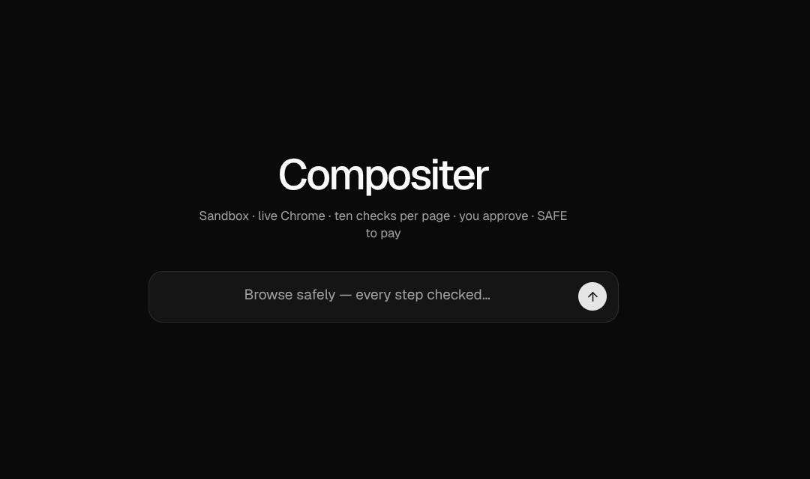
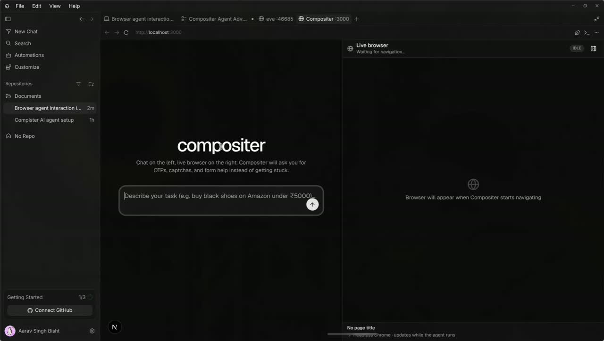
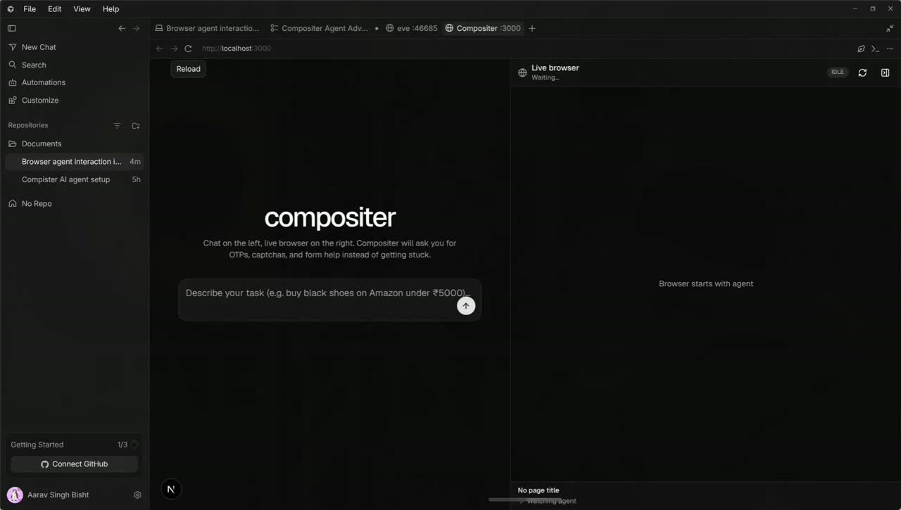
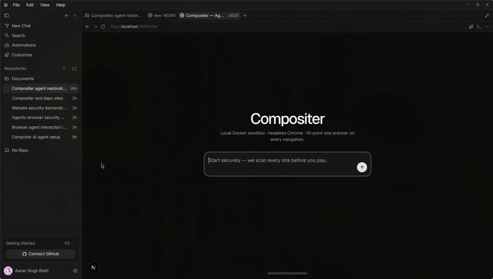

# Horizon

**Horizon** is a local-first **agentic browser** — a real browser that completes real web tasks for you, wrapped in layered security. Tasks execute inside isolated Docker sandboxes, drive a containerized headless browser through the [Browser Use VM](https://github.com/browser-use/browser-harness), pass on-device site-safety scoring, and stay human-in-the-loop through checkout — nothing touches your host machine or a cloud browser unless you ask.

Traveling through the browser is **Compositer**, the **agentic web agent** built with [Vercel eve](https://eve.dev) and [Browser Use browser-harness](https://github.com/browser-use/browser-harness). No MCP, no cloud required.

| Layer | Role |
|-------|------|
| **Horizon** | The agentic browser with security layers — sandboxing, isolated browsing, site-safety scoring, HITL payments |
| **Compositer** | The agent that travels through Horizon and completes your tasks |

## Demo

The ecosystem across three runs, in sequence — from first boot to the most complete final run.

**The main chat dialog, frame zero:**

[](assets/demo/03-final-evaluation.mp4)

### All runs

| # | Run | Length | Watch |
|---|-----|--------|-------|
| 1 | **First boot** — the first time firing the agent up | 2m09s | [▶ `01-first-boot.mp4`](assets/demo/01-first-boot.mp4) |
| 2 | **Durability run** — extended endurance run under sustained load | 12m31s | [▶ `02-durability-run.mp4`](assets/demo/02-durability-run.mp4) |
| 3 | **Final run** — the most complete end-to-end run | 2m44s | [▶ `03-final-run.mp4`](assets/demo/03-final-run.mp4) |

<details>
<summary>Thumbnails</summary>

| # | Run |
|---|-----|
| 1 | [](assets/demo/01-first-boot.mp4) |
| 2 | [](assets/demo/02-durability-run.mp4) |
| 3 | [](assets/demo/03-final-run.mp4) |

</details>

> Click any thumbnail/link to play — or open the files under `assets/demo/` locally after cloning.

## Architecture

```text
┌──────────────────────────────────────────────────────────┐
│  Next.js + eve (host)                                    │
│  Web chat UI ──► eve agent ──► Docker sandbox            │
│                               (compositer/eve-sandbox)   │
│                               browser-harness / bash     │
└───────────────────────────────┬──────────────────────────┘
                                │ BU_CDP_URL (Docker bridge)
                                ▼
┌──────────────────────────────────────────────────────────┐
│  compositer-chrome (Docker)                              │
│  Headless Chromium, CDP port 9222                        │
└──────────────────────────────────────────────────────────┘
```

- **eve** — durable agent framework, Web Chat UI, Docker sandbox backend
- **browser-harness** — open-source CDP harness from Browser Use (via `browser-use` skill)

---

## Docker & Sandbox System

Everything the agent does executes inside isolated containers. There are two moving parts:

### 1. Agent sandbox — `compositer/eve-sandbox`

Every task runs in an ephemeral [eve Docker sandbox](agent/sandbox/sandbox.ts), not on your host:

- **Image**: [`ghcr.io/vercel/eve:latest`](docker/eve-sandbox/Dockerfile) + browser-harness pre-installed (`uv tool install --python 3.12 browser-harness`, symlinked as `browser-use`)
- **Isolation**: file writes, shell commands, and browser control all happen inside the container; your host filesystem stays untouched
- **Networking**: `networkPolicy: allow-all`, so the sandbox can reach the Chrome container over the default Docker bridge
- **Self-healing bootstrap**: if `browser-harness` is missing at session start, eve reinstalls it inside the sandbox automatically

Rebuild the local image after changing the Dockerfile:

```bash
npm run sandbox:build        # = docker build -t compositer/eve-sandbox:local docker/eve-sandbox
```

### 2. Browser container — `compositer-chrome`

Headless Chromium defined in [`docker-compose.yml`](docker-compose.yml):

| Setting | Value | Why |
|---------|-------|-----|
| Image | `zenika/alpine-chrome` | Small, maintained Chromium image |
| Flags | `--no-sandbox --remote-debugging-address=0.0.0.0 --remote-debugging-port=9222` | Exposes CDP to the bridge network |
| Network | `network_mode: bridge` | Joins default bridge so sandbox containers can reach it by IP |
| shm_size | `256mb` | Prevents Chromium crashes on heavy pages |
| Restart | `unless-stopped` | Survives reboots |

```bash
npm run browser:up           # docker compose up -d chrome
npm run browser:down         # stop it
```

### How they connect

At session start, Horizon resolves the Chrome container's bridge-network IP (`docker inspect`) and injects it into the sandbox as `BU_CDP_URL`. browser-harness inside the sandbox then drives that headless Chrome over CDP — one container executes the agent's code, the other renders pages.

Override either side with `COMPOSITER_CHROME_CONTAINER` / `COMPOSITER_CHROME_CDP_URL` (see [Configuration](#configuration)).

---

## Prerequisites

- Node.js 24+ and npm
- Docker (daemon running)
- [Vercel AI Gateway](https://vercel.com/docs/ai-gateway) API key (or configure another provider in `agent/agent.ts`)

## Quick start

```bash
cd compositer
chmod +x scripts/setup.sh
./scripts/setup.sh

# Add your key to .env.local
# AI_GATEWAY_API_KEY=...

npm run dev
```

Open [http://localhost:3000](http://localhost:3000) and ask Compositer to browse a site.

The Web Chat shows **chat on the left** and a **live browser drawer on the right** (JPEG snapshots from headless Chrome). Compositer uses eve's `ask_question` tool for OTPs, captchas, and form help — answer in the amber banner or inline prompts.

## Manual setup

```bash
# 1. Sandbox image (eve base + browser-harness)
docker build -t compositer/eve-sandbox:local docker/eve-sandbox

# 2. Headless Chrome
docker compose up -d chrome

# 3. Environment
cp .env.example .env.local
# edit AI_GATEWAY_API_KEY

# 4. Run
npm run dev
```

## Scripts

| Command | Description |
|--------|-------------|
| `npm run dev` | Next.js app + eve agent (Web Chat) |
| `npm run dev:eve` | eve dev server only (terminal REPL) |
| `npm run browser:up` | Start Chrome container |
| `npm run browser:down` | Stop Chrome container |
| `npm run sandbox:build` | Rebuild local eve sandbox image |
| `npm run typecheck` | TypeScript check |

## Configuration

| Variable | Default | Purpose |
|----------|---------|---------|
| `AI_GATEWAY_API_KEY` | — | Model access via Vercel AI Gateway |
| `COMPOSITER_CHROME_CONTAINER` | `compositer-chrome` | Docker container name for Chrome |
| `COMPOSITER_CHROME_CDP_URL` | auto | Override CDP URL (skip docker inspect) |
| `COMPOSITER_SANDBOX_IMAGE` | `compositer/eve-sandbox:local` | eve sandbox Docker image |

## Troubleshooting

**Browser connection fails**

```bash
docker compose ps
curl http://127.0.0.1:9222/json/version
docker compose up -d chrome
```

**Sandbox image missing**

```bash
npm run sandbox:build
```

**Verify harness inside sandbox** (after eve creates a session)

The agent runs `browser-use` / `browser-harness` from the sandbox; `page_info()` should return URL and viewport info.

## Project layout

```text
horizon/
├── agent/                        # ★ Compositer — the agent that travels through the browser
│   ├── agent.ts                  #   model config (eve, glm-5.2)
│   ├── instructions.md           #   agent identity + HITL rules
│   ├── channels/eve.ts           #   eve channel wiring
│   ├── sandbox/sandbox.ts        #   Docker sandbox backend + Chrome CDP
│   └── skills/
│       ├── browser-use/SKILL.md  #   browser-harness skill
│       └── human-help/SKILL.md   #   when to ask the human
├── app/
│   ├── page.tsx                  #   agent chat UI + live browser drawer
│   ├── chat/page.tsx             #   dedicated chat entry
│   ├── login/page.tsx · signup/page.tsx
│   ├── api/
│   │   ├── browser/              #   fill-form · interact · preview · reset
│   │   ├── payment/              #   create-order · verify (Razorpay)
│   │   ├── security/             #   evaluate · stop
│   │   └── health/route.ts
│   └── _components/              #   security panel, HITL dialogs, checkout
├── assets/
│   └── demo/                     #   demo videos + posters (3 runs)
├── components/
│   ├── ai-elements/              #   message, tool, reasoning, prompt-input
│   └── ui/                       #   shadcn-ui primitives
├── lib/
│   ├── browser-*.ts              #   CDP bridge to the real Chrome
│   ├── security/                 #   ★ on-device site-safety engine
│   │   ├── checks/               #     10 checks (phishing, typosquatting, TLD…)
│   │   ├── evaluate.ts · risk-scorer.ts · check-registry.ts
│   │   └── use-security-monitor.ts
│   └── payment/                  #   razorpay-config.ts · checkout-hitl.ts
├── docker/
│   └── eve-sandbox/Dockerfile    #   local sandbox image
├── docs/
│   └── architecture.md           #   system flow & design
├── scripts/                      #   setup · start · restart · e2e-test · diagnose
├── docker-compose.yml            #   Chrome service
├── CHANGELOG.md · CONTRIBUTING.md · LICENSE
└── package.json
```

## Links

- [System flow & architecture](docs/architecture.md)
- [eve documentation](https://eve.dev/docs)
- [browser-harness](https://github.com/browser-use/browser-harness)
- [eve sandbox backends](https://eve.dev/docs/sandbox)
