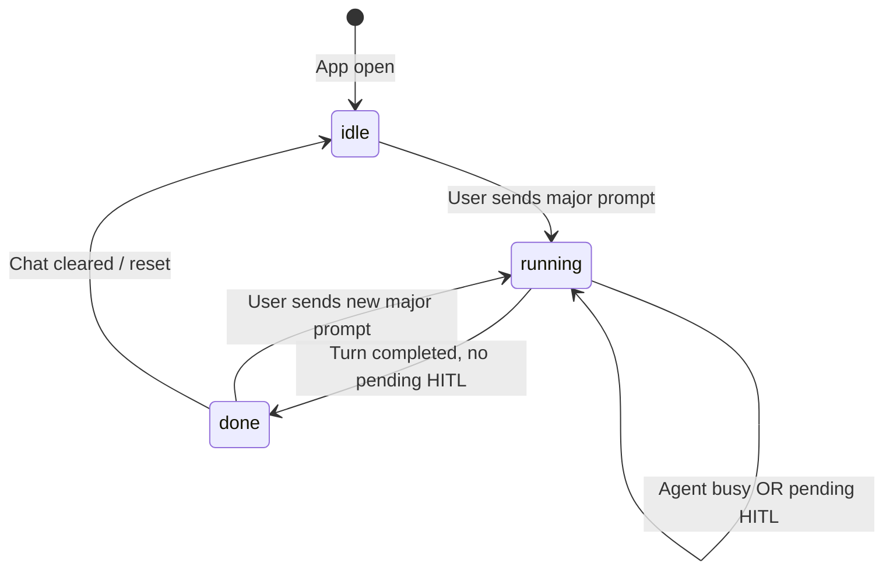
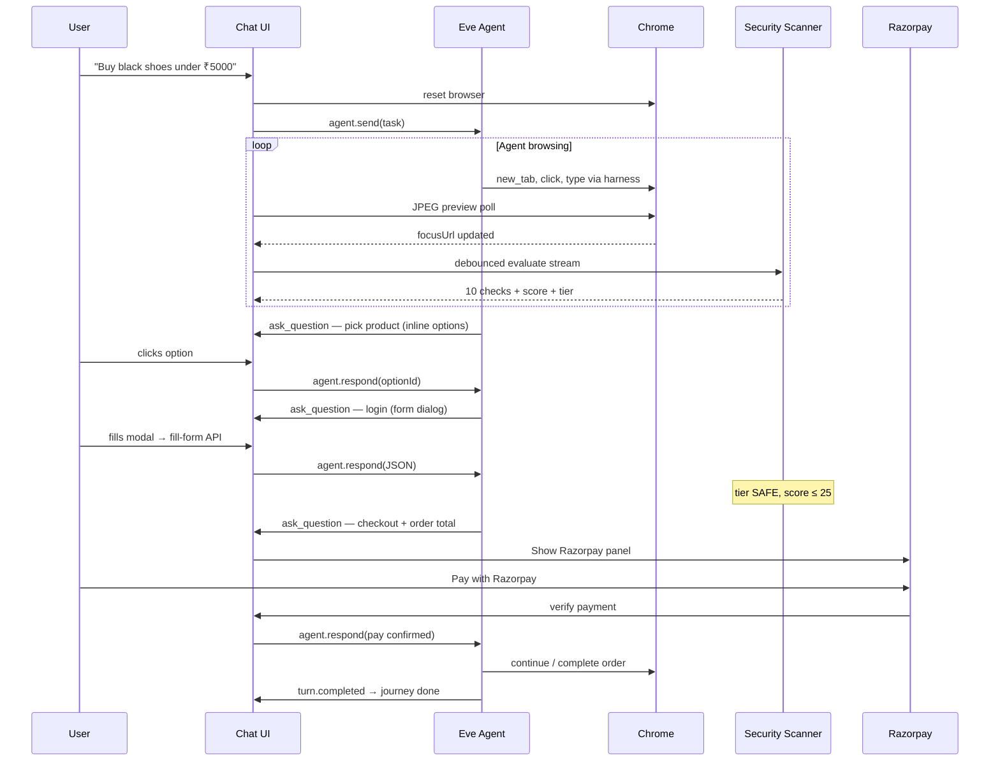

# Compositer — System Flow & Architecture (Detailed)

This document explains how **Compositer** works end-to-end: the Eve agent, live browser panel, human-in-the-loop (HITL), site safety scanner, Razorpay checkout, and user takeover. It is the companion to [`README.md`](README.md) (setup and quick start).

---

## 1. What Compositer is

Compositer is a **local AI browser agent**. You send one natural-language task (e.g. “buy black shoes on Amazon under ₹5000”). Compositer:

1. Runs an Eve agent in a Docker sandbox that drives **real headless Chrome** via browser-harness.
2. Shows a **live browser panel** beside chat so you watch every step.
3. **Pauses and asks you** at decision points (product pick, login, OTP, checkout) — chat is locked after the first message.
4. **Scans each site in parallel** with 10 local security metrics and scores risk 0–100.
5. On **SAFE** checkout, routes payment through **Compositer Razorpay** instead of the merchant’s checkout page.

Nothing runs in a cloud browser unless you explicitly ask. The agent, UI, security checks, and payment APIs all run on your machine (Next.js + Docker).

---

## 2. High-level architecture

```mermaid
flowchart TB
  subgraph ui [Next.js UI — localhost:3000]
    Chat[AgentChat]
  BrowserDrawer[BrowserDrawer]
  SecurityPanel[SecurityPanel]
  HitlDialog[HitlFormDialog]
  Razorpay[RazorpayCheckout]
  end

  subgraph eve_host [Eve host]
    EveAgent[Eve Agent — compositer]
    Sandbox[Docker sandbox — eve-sandbox]
    Harness[browser-harness / browser-use]
  end

  subgraph chrome [Docker — compositer-chrome]
    CDP[Chromium CDP :9222]
  end

  subgraph apis [Next.js API routes]
    Preview[/api/browser/preview]
    Interact[/api/browser/interact]
    SecurityEval[/api/security/evaluate]
    Payment[/api/payment/*]
  end

  Chat --> EveAgent
  EveAgent --> Sandbox
  Sandbox --> Harness
  Harness --> CDP

  BrowserDrawer --> Preview
  BrowserDrawer --> Interact
  SecurityPanel --> SecurityEval
  Razorpay --> Payment

  Preview --> CDP
  Interact --> CDP
  SecurityEval --> CDP
```

| Layer | Role |
|--------|------|
| **Eve agent** | Plans steps, calls `bash` → browser-harness, uses `ask_question` for HITL |
| **Docker sandbox** | Isolated shell; `BU_CDP_URL` points at Chrome on Docker bridge network |
| **Headless Chrome** | Real pages the agent automates; same instance used for live preview |
| **Next.js UI** | Chat, browser drawer, security cards, dialogs, Razorpay — does **not** replace the agent |
| **Security scanner** | Read-only CDP + URL heuristics; can cancel the agent on high risk |
| **Razorpay** | Hosted checkout only when site tier is **SAFE** and agent is at payment HITL |

---

## 3. Lifecycle of a single task (“journey”)

A **journey** starts when you send your first message and ends when the agent completes that turn (or you start a new task).



**Journey phases** (`lib/hitl-state.ts`):

| Phase | Meaning |
|--------|---------|
| `idle` | No messages yet |
| `running` | Task in progress — agent working or waiting on you |
| `done` | Agent finished the current turn; you can send a **new** task or browse freely |

**Composer lock:** After the first message, you cannot type follow-up chat. You only advance via **option buttons**, **form dialog**, or **Razorpay**. Exception: when `done`, the composer opens for a new task.

**Browser reset:** On the first major prompt, `POST /api/browser/reset` closes extra tabs and clears Chrome so each journey starts clean.

---

## 4. End-to-end flow (shopping example)



### 4.1 Agent side (what the model does)

Defined in [`agent/instructions.md`](agent/instructions.md) and skills:

1. Load `browser-use` before web work; load `human-help` on multi-step journeys.
2. Verify Chrome: `page_info()` via harness.
3. Navigate with `new_tab(url)`, inspect tree, click/type via harness.
4. After tab changes: **`activate_tab(target)`** so the live panel follows the right tab.
5. At every decision: **`ask_question`** with options (or form dialog for login/OTP).
6. Never guess product, cart, or payment — always ask.

Model: configured in [`agent/agent.ts`](agent/agent.ts) (Eve + AI Gateway).

### 4.2 UI side (what you see)

| Event | What appears |
|--------|----------------|
| Agent starts browsing | Browser drawer **Live**; JPEG preview ~500ms |
| URL changes | **Site checks** header + small cards per metric |
| Each check completes | Card shows rating (e.g. `0 · SAFE`), reasoning, then **fades after ~4.5s** |
| Agent asks product pick | Inline **option buttons** in chat + amber banner |
| Login / OTP / captcha | **Modal form dialog**; optional fill into browser |
| Agent asks checkout + SAFE | Green **Razorpay** panel |
| Medium risk (26–60) | **Review dialog** — Continue or Stop |
| High risk (61+) | Session killed + **“This site is not safe”** modal |

---

## 5. Live browser panel

The right drawer ([`browser-drawer.tsx`](app/_components/browser-drawer.tsx)) is **not** a remote desktop stream. It polls `GET /api/browser/preview` for JPEG screenshots of the same Chrome the agent uses.

### Modes

| Badge | Polling | You can click/type? |
|--------|---------|---------------------|
| **Idle** | ~15s | No |
| **Live** | ~500ms | No (watch agent) |
| **Your turn** | ~600ms | Yes |
| **You control** | ~600ms | Yes (Take Control) |

**Interactive when:**

- Pending HITL and agent paused (`lib/hitl-state.ts` → `isBrowserInteractive`)
- Journey **done** (free browse after task)
- **Take Control** (cancels agent turn, full manual control)
- Captcha/challenge heuristics on page URL/title (`lib/browser-challenge.ts`)

**Input path:** Clicks, keys, scroll, paste (Ctrl+V) → `POST /api/browser/interact` → Puppeteer on CDP page.

**Optimizations:** Double-buffered images, debounced resize, throttled `bringToFront`, loading bar only on first connect.

---

## 6. Human-in-the-loop (HITL)

Eve’s built-in **`ask_question`** tool pauses the agent until you respond via `agent.respond({ requestId, optionId?, text? })`.

### Two UI surfaces (by design)

| Type | UI | Examples |
|------|-----|----------|
| **Inline / banner** | Option buttons in chat + amber `HumanInputBanner` | Pick product, confirm add-to-cart, go back |
| **Form dialog** | Modal [`hitl-form-dialog.tsx`](app/_components/hitl-form-dialog.tsx) | Login, OTP, captcha, `FIELDS_JSON:` fields |

Detection: [`lib/hitl-ui.ts`](lib/hitl-ui.ts) — `isFormLikeHitl()` separates shopping choices from form-like prompts.

### Form dialog flow

1. Agent includes `FIELDS_JSON:[{"id":"email","label":"Email","type":"email"},…]` in prompt (optional).
2. User submits modal → `POST /api/browser/fill-form` fills Chrome → `agent.respond` with JSON text.
3. Agent continues same browser session.

### Mandatory checkpoints (shopping)

| Step | Agent action | Your UI |
|------|----------------|---------|
| Search results | `ask_question` with 3–5 products | Inline options |
| Add to cart | Confirm item | Inline options |
| Login | `FIELDS_JSON` + `allowFreeform` | Form dialog + interactive browser |
| OTP / captcha | `allowFreeform` | Form dialog + interactive browser |
| Checkout | Prompt with **order total** + Pay option | Inline + **Razorpay** if SAFE |

---

## 7. Site safety scanner (10 metrics)

Runs in the **Next.js app**, not inside the Eve agent. It does not slow prompts or add tools to the model.

### When it runs

- `focusUrl` changes (from agent browser events) → **800ms debounce** → `POST /api/security/evaluate` (NDJSON stream).
- Same hostname cached ~60s to reduce CDP contention with the agent.

### The 10 checks (local only)

| # | ID | Weight | What it checks |
|---|-----|--------|----------------|
| 1 | `https_transport` | 10 | URL uses HTTPS |
| 2 | `tls_page_match` | 8 | Active tab is HTTPS |
| 3 | `typosquatting` | 12 | Hostname vs known brands (Levenshtein) |
| 4 | `homograph_domain` | 10 | Punycode / mixed scripts |
| 5 | `suspicious_tld` | 8 | `.tk`, `.ml`, raw IP host, etc. |
| 6 | `phishing_url_path` | 10 | Suspicious path on non-brand host |
| 7 | `redirect_depth` | 8 | Navigation redirect count |
| 8 | `credential_form_risk` | 14 | Password field on risky host |
| 9 | `cross_origin_submit` | 10 | Form posts to another domain |
| 10 | `phishing_page_text` | 8 | Phishing phrases in title/body |

Each returns `pass` | `warn` | `fail` + reasoning text.

### Scoring

- **fail** → full weight  
- **warn** → half weight  
- **pass** → 0  

**Score 0–100** → tier:

| Tier | Score | Action |
|------|-------|--------|
| **SAFE** | 0–25 | Continue; Razorpay allowed at checkout |
| **REVIEW** | 26–60 | Cancel agent turn → warning dialog |
| **DANGER** | 61+ | Cancel + browser reset → block modal |

Implementation: [`lib/security/`](lib/security/), UI cards in [`security-panel.tsx`](app/_components/security-panel.tsx) with per-card fade-out.

---

## 8. Razorpay checkout (SAFE sites only)

Gated in [`agent-chat.tsx`](app/_components/agent-chat.tsx):

```text
showRazorpay =
  security.tier === "safe"
  AND security.phase === "safe"
  AND checkout HITL detected
  AND session not security-blocked
```

**Checkout HITL detection** ([`lib/payment/checkout-hitl.ts`](lib/payment/checkout-hitl.ts)): prompt mentions checkout / order total / payment **and** has a Pay / Razorpay option.

**Flow:**

1. `POST /api/payment/create-order` → Razorpay order (amount parsed from prompt, e.g. ₹4,499 → 449900 paise).
2. Client loads `checkout.razorpay.com/v1/checkout.js` → opens modal.
3. `POST /api/payment/verify` → HMAC signature check.
4. `agent.respond()` with pay option or success text → agent continues.

**Env** (see `.env.example`):

```bash
RAZORPAY_KEY_ID=rzp_test_...
RAZORPAY_KEY_SECRET=...
RAZORPAY_CURRENCY=INR
```

Never commit secrets. Test keys only in `.env.local`.

If keys are missing, demo mode simulates success without calling Razorpay.

---

## 9. Take Control vs security block

| Action | Who triggers | Agent | Browser |
|--------|----------------|-------|---------|
| **Take Control** | You, header button | `cancel()` if busy | Fully interactive until “Return to agent” |
| **REVIEW dialog** | Security scanner | `cancel()` | Dialog: Continue / Stop |
| **DANGER block** | Security scanner | `cancel()` + reset | Block modal; close session resets Eve |

Take Control is for convenience. Security block is automatic protection.

---

## 10. API surface (reference)

### Browser

| Route | Purpose |
|-------|---------|
| `GET /api/browser/preview` | JPEG screenshot + URL/title |
| `POST /api/browser/interact` | click, type, scroll, keypress |
| `POST /api/browser/fill-form` | Fill inputs from HITL dialog |
| `POST /api/browser/reset` | Close tabs, blank first tab |

### Security

| Route | Purpose |
|-------|---------|
| `POST /api/security/evaluate` | NDJSON stream: check-start, check-result, complete |
| `POST /api/security/stop` | Abort in-flight evaluation |

### Payment

| Route | Purpose |
|-------|---------|
| `POST /api/payment/create-order` | Create Razorpay order |
| `POST /api/payment/verify` | Verify payment signature |

---

## 11. Project map (key files)

```text
agent/
  instructions.md          # Agent identity + HITL rules
  skills/
    browser-use/           # Harness CLI patterns
    human-help/            # ask_question examples + FIELDS_JSON + Razorpay
  sandbox/sandbox.ts       # Docker + BU_CDP_URL

app/
  _components/
    agent-chat.tsx         # Orchestrator: Eve, security, HITL, Razorpay
    browser-drawer.tsx     # Live preview + Take Control
    hitl-form-dialog.tsx   # Login / OTP / captcha modal
    human-input-banner.tsx # Inline HITL (non-form)
    security-panel.tsx     # Live safety cards
    razorpay-checkout.tsx  # SAFE checkout UI
  api/browser/           # CDP preview + interact
  api/security/          # Streaming evaluator
  api/payment/           # Razorpay server routes

lib/
  hitl-state.ts            # Journey phase, composer lock, browser interactive
  hitl-ui.ts               # Form-like vs shopping HITL
  security/                # Checks, scorer, use-security-monitor
  payment/                 # Checkout detection, Razorpay config
  browser-cdp-shared.ts    # Puppeteer pool + CDP lock
```

---

## 12. Scripts & tests

| Command | Purpose |
|---------|---------|
| `npm run dev` / `bash scripts/restart.sh` | Run app + Eve |
| `npm run browser:up` | Start `compositer-chrome` |
| `python3 scripts/security-eval-test.py` | SAFE vs risky URL scoring |
| `python3 scripts/e2e-test.py` | Eve session + HITL smoke |

---

## 13. Mental model (one paragraph)

You describe a task once. Compositer’s Eve agent drives headless Chrome through a sandbox while you watch JPEG previews. At each decision the agent **`ask_question`**s — you answer via inline buttons or a form dialog, never free chat mid-journey. In parallel, the UI runs **ten local security checks** on every navigation, shows small reasoning cards that fade away, and **stops or warns** on risky sites. If the journey reaches checkout and the site is **SAFE**, payment goes through **Compositer Razorpay**; the agent never uses the merchant’s pay button. You can **Take Control** anytime to use the browser yourself, then return or start a new task when the journey is **done**.

---

## 14. Related docs

- Setup & env: [`README.md`](README.md)
- Eve: [eve.dev](https://eve.dev)
- Browser harness: [browser-use/browser-harness](https://github.com/browser-use/browser-harness)
